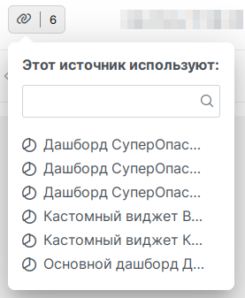
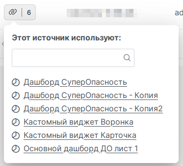

# Visiology 3 some UI quirks and workarounds

Installation [link]() for the impatient (please read section [installation](#installation) for the prerequisites and detailed instructions).

# Purpose

[User.js](http://kb.mozillazine.org/User.js_file) script to enrich great Russian BI [Visiology version 3](https://ru.visiology.su/).

Visiology 3 is young product, meantime has great capabilities.
Its UI is on active development and because that have some quirks.
For example in administration area in context menu of datasets you will see only truncated list of dashboard names, which frequently simply are not distinguishable:

This script show it widely and turns into clickable links:

# Installation

## Prerequisites

### Requires browser extension like `tampermonkey`
- [Chrome, chromium](https://chrome.google.com/webstore/detail/tampermonkey/dhdgffkkebhmkfjojejmpbldmpobfkfo?hl=en)
- [Firefox](https://addons.mozilla.org/en-US/firefox/addon/tampermonkey/)

## Script installation
Just follow the [link]().

> **TIP** Script configured for auto-updates, just allow that in extension settings!

# Ideas and bug-reports are welcome!

Please report issues in this repository and ping me directly for any bugreports or needed enhancements!

# Licensed under MIT License